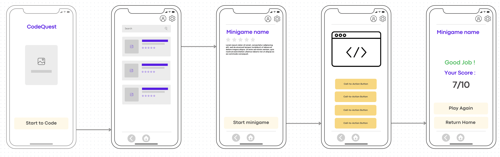

# Université Côte d'Azur - DS4H - EMSI - IA2
## Cours de Programmation Mobile et IA - Leo Donati
## TD3 - Soyez créatif avec l'IA

Dans ce TD, vous pouvez choisir quelle technologie vous voulez utiliser pour ajouter de l'IA à votre application. Vous pouvez utiliser des modèles pré-entrainés, des API ou créer votre propre modèle.

Ce TD est à faire en groupe de 2 ou 3 personnes.

### Membres du groupe
- **PIERSON Quentin**
- **DAO Tuan Linh**

## Présentation du Projet

**CodeQuest** est une application web éducative utilisant l'intelligence artificielle (IA) pour créer des mini-jeux interactifs permettant aux utilisateurs de tester et renforcer leurs connaissances en programmation. L'application génère dynamiquement des exercices de code et des questions théoriques grâce à l'API ChatGPT d'OpenAI.

### Objectifs

- Rendre l'apprentissage de la programmation ludique et interactif.
- Faciliter la révision et la consolidation des connaissances en développement logiciel.
- Proposer des exercices uniques et variés générés automatiquement par une IA.
- Permettre aux utilisateurs de mesurer et suivre leur progression.

### Fonctionnalités Principales

#### 1. Quiz interactif (QCM)
- L'application génère automatiquement des extraits de code en langage Python (et potentiellement d'autres langages).
- L'utilisateur doit identifier la sortie correcte du programme parmi plusieurs choix (A, B, C ou D).
- L'IA crée également des questions théoriques sur des concepts clés de programmation pour renforcer la compréhension.

### Technologie
- Utilisation de l'API ChatGPT (OpenAI) pour générer dynamiquement le contenu pédagogique (extraits de code et questions théoriques).
- Interface mobile intuitive, facile d'utilisation et responsive.

## Maquette de l'interface graphique

- **Page d'accueil :** Nom de l'application et bouton pour commencer.
- **Page des mini-jeux :** Liste des mini-jeux sous forme de cartes, avec barre de recherche pour faciliter la sélection rapide.
- **Page de description :** Détails sur chaque mini-jeu et bouton pour démarrer le quiz.
- **Page du quiz :** Affichage d'extraits de code ou questions théoriques générés par IA, avec plusieurs réponses possibles.
- **Page de résultats :** Affichage de la note finale, avec options pour retourner au menu principal ou recommencer un quiz.

### Objectifs atteints

- [x] Mise en place de l’interface principale avec :
    - [x] Barre de recherche fonctionnelle pour filtrer les quiz
    - [x] Liste des quiz sous forme de cartes (titre, description, note, image)
- [x] Navigation entre les écrans avec des routes typées `@Serializable`
- [x] Détail d’un quiz :
    - [x] Affichage du titre, description, image
    - [x] Bouton "Commencer"
- [x] Écran de quiz :
    - [x] Affichage de l’extrait de code (bloc de 400dp, centré verticalement)
    - [x] Question placée juste au-dessus des réponses
    - [x] Choix sous forme de boutons cochables (visuel checkbox)
    - [x] Prise en charge de plusieurs bonnes réponses
    - [x] Bouton "Suivant" ou "Voir le score" centré en bas
    - [x] Navigation entre les questions
    - [x] Réinitialisation du quiz quand on recommence
- [x] Gestion du score :
    - [x] Calcul avec comparaison des réponses multiples
    - [x] Message personnalisé selon la performance
    - [x] Couleurs dynamiques selon le résultat (succès / moyen / échec)
- [x] Écran de résultats :
    - [x] Affiche le titre du quiz, le score, et un message
    - [x] Bouton "Retour à l’accueil" fonctionnel
    - [x] Bouton "Voir les réponses" juste au-dessus
- [x] Écran de correction :
    - [x] Liste scrollable des questions et réponses
    - [x] Code affiché dans un bloc dédié
    - [x] Réponses correctes en vert, erreurs en rouge, neutres en gris
    - [x] Bouton "Retour à l’accueil" en bas

- [ ] Intégration de l’API ChatGPT pour générer dynamiquement les questions
- [ ] Analyse et transformation des réponses de l’IA en objets `Question`
- [ ] Possibilité de rejouer une série générée par l’IA

### Liens vers la vidéo
